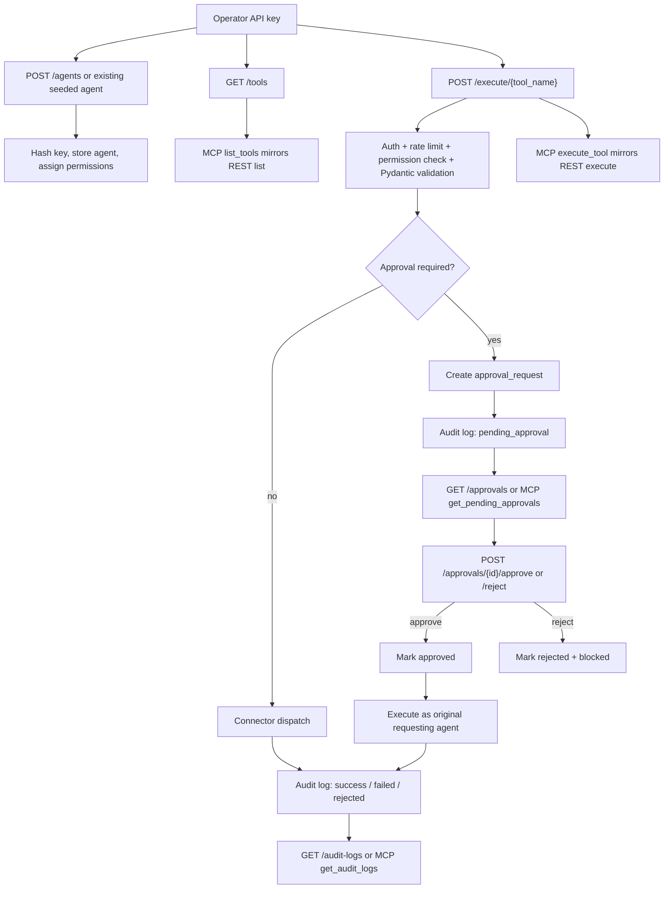

# Agent Flow Review: Agent Gateway

Scope: create agent, list tools, execute read tool, execute write tool requiring approval, approve request, reject request, audit logging, MCP tool execution, and the frontend approval flow.

## Text Flow Diagram

## Broken Flows

1. P1: The tool registry is metadata-only, not a real dispatch registry.
   Affected files: [backend/app/routers/tools.py:62](/Users/priyanshupatel/Documents/GitHub/ai%20operating%20system/backend/app/routers/tools.py#L62), [backend/app/services/execution_service.py:33](/Users/priyanshupatel/Documents/GitHub/ai%20operating%20system/backend/app/services/execution_service.py#L33), [backend/app/services/execution_service.py:43](/Users/priyanshupatel/Documents/GitHub/ai%20operating%20system/backend/app/services/execution_service.py#L43), [backend/app/schemas/tool_schema.py:141](/Users/priyanshupatel/Documents/GitHub/ai%20operating%20system/backend/app/schemas/tool_schema.py#L141), [backend/app/mcp_server/tools.py:40](/Users/priyanshupatel/Documents/GitHub/ai%20operating%20system/backend/app/mcp_server/tools.py#L40)
   Why it matters: `POST /tools` can persist arbitrary `tool_name` and `connector_type` values, but execution only understands the seven hardcoded seed tool names in `TOOL_INPUT_MODELS` plus the hardcoded connector branches in `_execute_connector()`. A tool can list successfully, be permissioned successfully, and still fail at runtime with `501 Not Implemented`. That breaks the advertised create-list-execute flow and makes the registry misleading.
   Suggested fix: either reject unsupported tool/connector combinations at creation time or introduce a real pluggable dispatch registry that maps stored tool metadata to registered executor functions and validation models.

2. P1: Approval, audit, and execution state transitions are not atomic.
   Affected files: [backend/app/services/approval_service.py:15](/Users/priyanshupatel/Documents/GitHub/ai%20operating%20system/backend/app/services/approval_service.py#L15), [backend/app/services/approval_service.py:107](/Users/priyanshupatel/Documents/GitHub/ai%20operating%20system/backend/app/services/approval_service.py#L107), [backend/app/services/execution_service.py:110](/Users/priyanshupatel/Documents/GitHub/ai%20operating%20system/backend/app/services/execution_service.py#L110), [backend/app/services/execution_service.py:118](/Users/priyanshupatel/Documents/GitHub/ai%20operating%20system/backend/app/services/execution_service.py#L118), [backend/app/services/execution_service.py:153](/Users/priyanshupatel/Documents/GitHub/ai%20operating%20system/backend/app/services/execution_service.py#L153), [backend/app/services/execution_service.py:168](/Users/priyanshupatel/Documents/GitHub/ai%20operating%20system/backend/app/services/execution_service.py#L168), [backend/app/services/execution_service.py:186](/Users/priyanshupatel/Documents/GitHub/ai%20operating%20system/backend/app/services/execution_service.py#L186), [backend/app/services/execution_service.py:201](/Users/priyanshupatel/Documents/GitHub/ai%20operating%20system/backend/app/services/execution_service.py#L201), [backend/app/routers/approvals.py:73](/Users/priyanshupatel/Documents/GitHub/ai%20operating%20system/backend/app/routers/approvals.py#L73), [backend/app/routers/approvals.py:133](/Users/priyanshupatel/Documents/GitHub/ai%20operating%20system/backend/app/routers/approvals.py#L133)
   Why it matters: the approval flow is split across multiple commits. `execute_tool()` creates the approval request, then writes the pending audit event in a later commit. When an approval is later granted, the approve route first marks the request approved, then executes the tool, then writes the execution audit, then updates the approval row again. The reject route also does two commits. Any failure between those writes can leave the system in a contradictory state such as "approval exists but no audit row", "audit says success but approval still not_run", or "rejected but execution_status never became blocked". This is the biggest end-to-end integrity risk in the flow.
   Suggested fix: make approval creation, approval decision, execution result, and the matching audit insert part of a single transaction boundary or an explicit state machine with idempotent transitions and row-level locking.

3. P1: Approval decisions are not attributable or auditable.
   Affected files: [backend/app/models/approval.py:13](/Users/priyanshupatel/Documents/GitHub/ai%20operating%20system/backend/app/models/approval.py#L13), [backend/app/models/approval.py:57](/Users/priyanshupatel/Documents/GitHub/ai%20operating%20system/backend/app/models/approval.py#L57), [backend/app/routers/approvals.py:51](/Users/priyanshupatel/Documents/GitHub/ai%20operating%20system/backend/app/routers/approvals.py#L51), [backend/app/routers/approvals.py:111](/Users/priyanshupatel/Documents/GitHub/ai%20operating%20system/backend/app/routers/approvals.py#L111), [backend/app/services/approval_service.py:107](/Users/priyanshupatel/Documents/GitHub/ai%20operating%20system/backend/app/services/approval_service.py#L107)
   Why it matters: the model records the requestor, tool, decision reason, and timestamps, but it does not store who approved or rejected the request. The routes authenticate `current_agent`, but that identity is never persisted. There is also no audit log row for the human decision itself. That means the system can tell you that a request was approved, but not which operator approved it, and it cannot reconstruct approval/rejection history from the audit log alone.
   Suggested fix: add `decided_by_agent_id` or `approved_by_agent_id` to `ApprovalRequest`, persist it in the decision routes, and write a dedicated audit event for approve/reject actions. The existing `audit_log_id` field should either be populated or removed if it is not part of the final design.

4. P1: Self-approval is allowed, so approval is not an independent control.
   Affected files: [backend/app/services/permission_service.py:72](/Users/priyanshupatel/Documents/GitHub/ai%20operating%20system/backend/app/services/permission_service.py#L72), [backend/app/routers/approvals.py:66](/Users/priyanshupatel/Documents/GitHub/ai%20operating%20system/backend/app/routers/approvals.py#L66), [backend/app/seed.py:164](/Users/priyanshupatel/Documents/GitHub/ai%20operating%20system/backend/app/seed.py#L164), [backend/app/seed.py:179](/Users/priyanshupatel/Documents/GitHub/ai%20operating%20system/backend/app/seed.py#L179)
   Why it matters: any agent with `can_approve` can approve a request, including the original requesting agent. The seeded demo operator is also given `can_execute` and `can_approve` for every tool, so the local starter credential can request, approve, and execute high-risk writes by itself. That is a classic separation-of-duties bypass if this pattern is carried into production.
   Suggested fix: block self-approval by default, or require a distinct reviewer role and record that reviewer in the approval row and audit trail.

5. P2: Approval lookup uses mutable tool_name instead of stable tool_id.
   Affected files: [backend/app/routers/approvals.py:62](/Users/priyanshupatel/Documents/GitHub/ai%20operating%20system/backend/app/routers/approvals.py#L62), [backend/app/routers/approvals.py:122](/Users/priyanshupatel/Documents/GitHub/ai%20operating%20system/backend/app/routers/approvals.py#L122), [backend/app/models/approval.py:27](/Users/priyanshupatel/Documents/GitHub/ai%20operating%20system/backend/app/models/approval.py#L27)
   Why it matters: the approval row already stores `tool_id`, but both approve and reject resolve the tool by `approval.tool_name`. If the name ever changes, if metadata drifts, or if a manual correction happens, pending approvals become unmanageable even though the stable foreign key still exists.
   Suggested fix: resolve the tool from `tool_id` and treat `tool_name` as historical display data only.

6. P2: Agent creation lacks list deduping and runtime consistency checks.
   Affected files: [backend/app/routers/agents.py:78](/Users/priyanshupatel/Documents/GitHub/ai%20operating%20system/backend/app/routers/agents.py#L78), [backend/app/routers/agents.py:93](/Users/priyanshupatel/Documents/GitHub/ai%20operating%20system/backend/app/routers/agents.py#L93), [backend/app/routers/agents.py:102](/Users/priyanshupatel/Documents/GitHub/ai%20operating%20system/backend/app/routers/agents.py#L102), [backend/app/services/execution_service.py:33](/Users/priyanshupatel/Documents/GitHub/ai%20operating%20system/backend/app/services/execution_service.py#L33)
   Why it matters: duplicate tool names inside `allowed_tool_names` or `approvable_tool_names` can generate duplicate permission inserts and cause the transaction to fail on the unique constraint. More importantly, the route only checks that a tool exists in the registry table; it does not check that the tool is actually executable in the current runtime wiring. An agent can be granted permissions to a tool that will still fail with `501` later because the execution model is missing.
   Suggested fix: dedupe the incoming lists, validate the intended permission relationship between execute and approve, and reject any tool that does not have a registered execution model and connector handler.

7. P2: Registry mutations are not audit-logged.
   Affected files: [backend/app/routers/agents.py:56](/Users/priyanshupatel/Documents/GitHub/ai%20operating%20system/backend/app/routers/agents.py#L56), [backend/app/routers/tools.py:62](/Users/priyanshupatel/Documents/GitHub/ai%20operating%20system/backend/app/routers/tools.py#L62), [backend/app/services/audit_service.py:13](/Users/priyanshupatel/Documents/GitHub/ai%20operating%20system/backend/app/services/audit_service.py#L13)
   Why it matters: creating agents and tools changes who can do what, but those control-plane actions leave no audit trail at all. For a system that is supposed to control enterprise data access, the absence of an audit record for registry changes is a serious blind spot.
   Suggested fix: write an audit event for agent creation, tool creation, and any future permission edits, or add a dedicated admin-action audit table with actor identity and payload diffs.

8. P2: The frontend approval flow assumes an all-or-nothing backend response and can stay stale after a partial failure.
   Affected files: [frontend/app/approvals/page.tsx:43](/Users/priyanshupatel/Documents/GitHub/ai%20operating%20system/frontend/app/approvals/page.tsx#L43), [frontend/app/approvals/page.tsx:52](/Users/priyanshupatel/Documents/GitHub/ai%20operating%20system/frontend/app/approvals/page.tsx#L52), [frontend/app/approvals/page.tsx:56](/Users/priyanshupatel/Documents/GitHub/ai%20operating%20system/frontend/app/approvals/page.tsx#L56)
   Why it matters: the UI posts approve/reject, ignores the returned approval payload, and only refreshes after a clean success. If the backend has already committed the decision but then fails during execution or the blocked-state update, the operator sees an error but the approval list may still be stale until a manual refresh. The UI also cannot show who approved the request because the backend never stores that identity.
   Suggested fix: return and render the updated approval record from the API, and make the frontend resilient to partial-success backend states by refreshing or reconciling after any request that mutates approval state.

## Missing Validations

1. The tool creation API accepts any `connector_type` string.
   Affected files: [backend/app/routers/tools.py:63](/Users/priyanshupatel/Documents/GitHub/ai%20operating%20system/backend/app/routers/tools.py#L63), [backend/app/routers/tools.py:75](/Users/priyanshupatel/Documents/GitHub/ai%20operating%20system/backend/app/routers/tools.py#L75)
   Why it matters: you can persist a tool that looks valid in the registry but has no real executor behind it.
   Suggested fix: constrain `connector_type` to the supported connector set and reject unsupported combinations before the row is committed.

2. The "safe select" connector does not enforce a true read-only boundary.
   Affected files: [backend/app/connectors/postgres_connector.py:36](/Users/priyanshupatel/Documents/GitHub/ai%20operating%20system/backend/app/connectors/postgres_connector.py#L36), [backend/app/connectors/postgres_connector.py:54](/Users/priyanshupatel/Documents/GitHub/ai%20operating%20system/backend/app/connectors/postgres_connector.py#L54), [backend/app/connectors/postgres_connector.py:60](/Users/priyanshupatel/Documents/GitHub/ai%20operating%20system/backend/app/connectors/postgres_connector.py#L60)
   Why it matters: the current guard is a regex filter over raw SQL text, not an AST-based validator or a read-only database role. The read-tool flow depends entirely on string matching and the privileges of the connected database user.
   Suggested fix: run the connector against a read-only account and parse/allowlist the SQL AST instead of matching forbidden keywords in the raw string.

3. Approve/reject routes do not validate against duplicate submissions or concurrent decisions.
   Affected files: [backend/app/routers/approvals.py:58](/Users/priyanshupatel/Documents/GitHub/ai%20operating%20system/backend/app/routers/approvals.py#L58), [backend/app/routers/approvals.py:67](/Users/priyanshupatel/Documents/GitHub/ai%20operating%20system/backend/app/routers/approvals.py#L67), [backend/app/routers/approvals.py:118](/Users/priyanshupatel/Documents/GitHub/ai%20operating%20system/backend/app/routers/approvals.py#L118), [backend/app/routers/approvals.py:127](/Users/priyanshupatel/Documents/GitHub/ai%20operating%20system/backend/app/routers/approvals.py#L127)
   Why it matters: two parallel requests can both see `pending` before either one commits, which can lead to duplicate approval decisions or duplicate tool execution.
   Suggested fix: take a row lock on the approval row, or store a monotonic state transition token and reject stale updates.

4. The frontend dashboard has no create-agent or permission-management UI.
   Affected files: [frontend/app/agents/page.tsx:12](/Users/priyanshupatel/Documents/GitHub/ai%20operating%20system/frontend/app/agents/page.tsx#L12)
   Why it matters: the backend supports `POST /agents`, but the dashboard only lists agents. The create-agent flow is API-only, so operators cannot complete the full control-plane lifecycle from the UI.
   Suggested fix: add a create-agent form and a permission editor, or clearly document that agent creation is intentionally API-only for the MVP.

## Edge Cases

1. A created approval can exist without any audit row if the audit insert fails after the approval commit.
   The UI will still surface the approval later, but the execution attempt will be missing from the audit log.

2. A decision can be recorded without a matching execution status if the final commit fails.
   The approval row may remain `approved` or `rejected` while `execution_status` stays stale.

3. A retry or duplicate click on the approve endpoint can duplicate side effects.
   This is especially dangerous for `send_email`, `append_row`, and `call_internal_api`.

4. A pending approval can become effectively orphaned if the tool name changes.
   The stored `tool_id` could still resolve, but the current code never uses it for decision routing.

5. The local demo credential is powerful enough to self-approve.
   That is fine for a local starter kit, but it should not survive unchanged into a sensitive deployment.

6. The frontend stores the operator key in browser local storage.
   That is acceptable for an MVP, but it means the approval flow is only as safe as the browser session that holds the key.

## What Is Working Well

1. REST and MCP both delegate to the same backend services for auth, permissions, execution, approvals, and audit retrieval.
2. Unknown tools are rejected instead of being silently ignored.
3. API keys are hashed before storage, and the execution path validates tool inputs with Pydantic before calling connectors.
4. The dashboard keeps approval and audit views separate, which makes the operator flow easy to follow even in the MVP.
